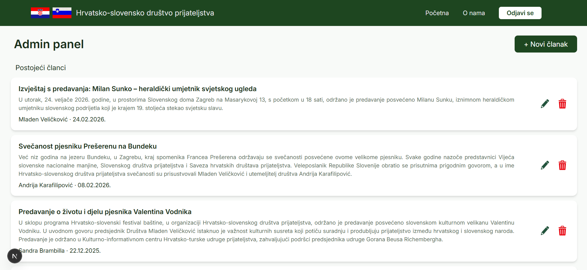
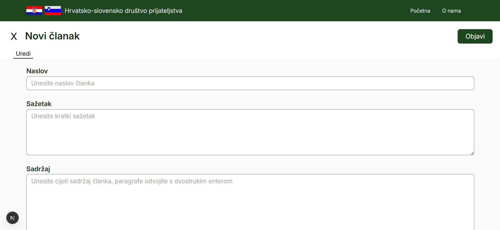
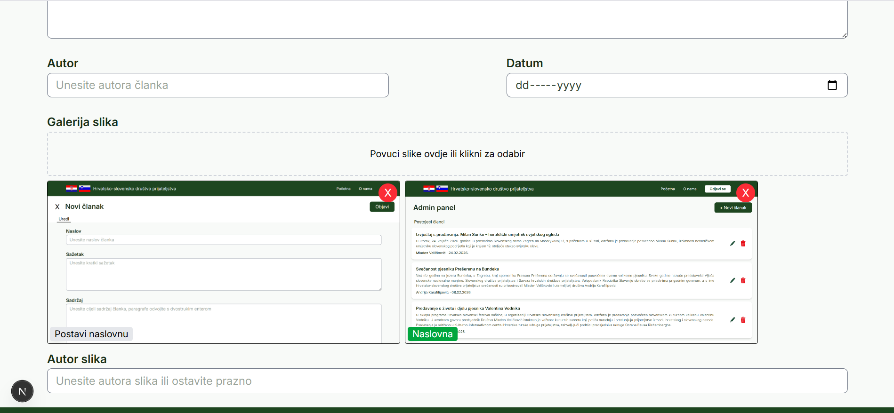

# HSDP Web Application

Official website for HSDP (Hrvatsko-slovensko društvo prijateljstva) - an organization dedicated to fostering cultural and social connections between Croatia and Slovenia. 
The application was built with Next.js and Supabase.

## About

A full-stack web application featuring a public-facing news/article section and a protected admin panel for content management.

## Features

- Explore and read articles with image galleries
- Admin panel for creating, editing, and deleting articles
- Image upload to Supabase Storage
- Secure admin authentication

## Tech Stack

- **Framework**: Next.js (App Router)
- **Language**: TypeScript
- **Styling**: Tailwind CSS
- **Backend**: Supabase (PostgreSQL, Auth, Storage)
- **Deployment**: Vercel
- **DNS/CDN**: Cloudflare

## Live Demo

[hsdp-org.hr](https://hsdp-org.hr)

## Screenshots
The following screenshots showcase the admin panel functionality. The first image shows the article dashboard, where articles can be viewed, edited, created, or deleted. 
The remaining images show the article creation form, which includes an image drop zone for easy upload. 

  

  

## License

© 2025 HSDP. All rights reserved.  
This code is publicly available for viewing purposes only. Copying, using, or distributing any part of this codebase without written permission from the author is not permitted.
